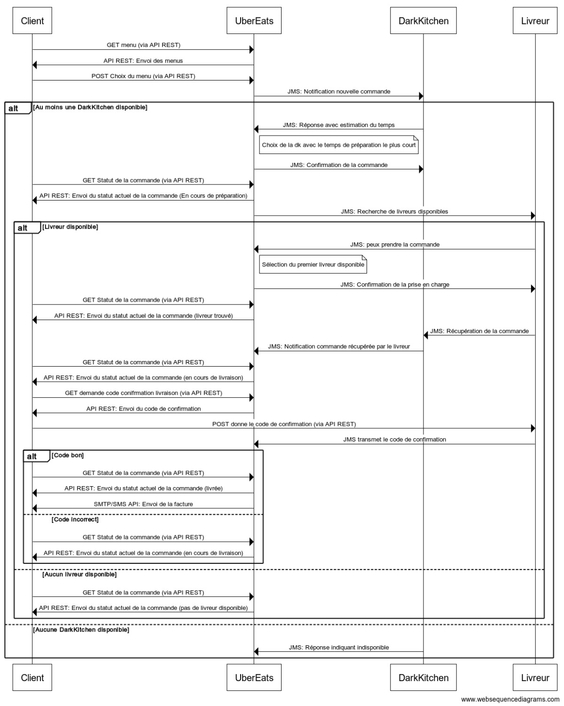

## Objectifs du système à modéliser
Ce projet modélise un système de commande et de livraison pour une plateforme de type Uber Eats, intégrant des interactions entre le client, le système Uber Eats, les cuisines partenaires (Dark Kitchen) et les livreurs. Le système permet au client de choisir un menu, passer une commande, et suivre le statut de cette commande jusqu'à la livraison.

* Le client peut consulter les menus disponibles via une API REST.
* Le client peut passer une commande qui sera envoyée à toutes les Dark Kitchens.
* Chaque Dark Kitchen donne une estimation de temps de préparation via JMS.
* Uber Eats recherche des livreurs disponibles. Les livreurs disponibles et avec le mode de transport acceptent la commande. UberEat selectionne le premier livreur.
* Le client peut suivre le statut de sa commande via l'API REST à différentes étapes.
* Le livreur récupère la commande à la Dark Kitchen. 
* Le client reçoit un code de confirmation pour valider la livraison que le livreur doit donner à UberEat via l'API REST. La commande est livrée,une facture est générée et envoyée au client.

## Interfaces

    Client->UberEats: GET menu (via API REST)
    UberEats->Client : API REST: Envoi des menus
    Client->UberEats: POST Choix du menu (via API REST)
    UberEats->DarkKitchen : JMS: Notification nouvelle commande

    alt Au moins une DarkKitchen disponible
        DarkKitchen->UberEats: JMS: Réponse avec estimation du temps
        note right of UberEats: Choix de la dk avec le temps de préparation le plus court
        UberEats->DarkKitchen : JMS: Confirmation de la commande
        Client->UberEats: GET Statut de la commande (via API REST)
        UberEats->Client: API REST: Envoi du statut actuel de la commande (En cours de préparation)
        UberEats->Livreur: JMS: Recherche de livreurs disponibles

        alt Livreur disponible
            Livreur->UberEats: JMS: peux prendre la commande
            note right of UberEats: Sélection du premier livreur disponible
            UberEats->Livreur: JMS: Confirmation de la prise en charge
            Client->UberEats: GET Statut de la commande (via API REST)
            UberEats->Client: API REST: Envoi du statut actuel de la commande (livreur trouvé)
            Livreur->DarkKitchen : JMS: Récupération de la commande
            DarkKitchen ->UberEats: JMS: Notification commande récupérée par le livreur
            Client->UberEats: GET Statut de la commande (via API REST)
            UberEats->Client: API REST: Envoi du statut actuel de la commande (en cours de livraison)
        else Aucun livreur disponible
            Client->UberEats: GET Statut de la commande (via API REST)
            UberEats->Client: API REST: Envoi du statut actuel de la commande (pas de livreur disponible)
        end

        Client->UberEats: GET demande code conifrmation livraison (via API REST)
        UberEats->Client: API REST: Envoi du code de confirmation
        Client->Livreur: POST donne le code de confirmation (via API REST)
        Livreur->UberEats: JMS transmet le code de confirmation

        alt Code bon
            Client->UberEats: GET Statut de la commande (via API REST)
            UberEats->Client: API REST: Envoi du statut actuel de la commande (livrée)
            UberEats->Client: SMTP/SMS API: Envoi de la facture
        else Code incorrect
            Client->UberEats: GET Statut de la commande (via API REST)
            UberEats->Client: API REST: Envoi du statut actuel de la commande (en cours de livraison)
        end
    else Aucune DarkKitchen disponible
        DarkKitchen->UberEats: JMS: Réponse indiquant indisponible
    end

## Exigences fonctionnelles ET non fonctionnelles par système

### Uber Eats

* Uber Eats DOIT permettre aux clients de choisir un plat via une API REST.
* Uber Eats DOIT demander et recevoir des estimations de temps de préparation et de livraison des restaurants via JMS.
* Uber Eats DOIT assigner la commande au restaurant ayant le temps de préparation le plus court.
* Uber Eats DOIT assigner les commandes aux livreurs disponibles en fonction de leur mode de transport et leur disponibilité avec le restaurant via JMS.
* Uber Eats DOIT informer les clients de l'état de leur commande via REST.
* En cas d'indisponibilité de livreurs ou de darkkitchen, le système DOIT notifier les clients de l'annulation via API REST.

### Dark Kitchens

* Les dark kitchen DOIVENT pouvoir reçevoir une notification via UberEats d’une commande à réaliser.
* Les dark kitchen DOIVENT pouvoir donner une estimation du temps de préparation de la commande à Uber via JMS

### Livreurs

* Un livreur reçoit des commandes de la part d’uber
* Un livreur DOIT livrer une seule commande en même temps
* Un livreur peut accepter ou refuser une commande 
* Le livreur a accès aux information de la commande 
* Le livreur doit confirmer la prise en charge d’une commande auprès du restaurant, ce qui va faire passer le statut de la commande de “en préparation” à “en cours de livraison”, Uber en est informé via JMS.
* Le livreur doit confirmer la livraison en faisant le post d’un code fourni par le client, ce qui va faire passer le statut de la commande de “en cours de livraison” à “livré”, Uber en est informé via JMS.

